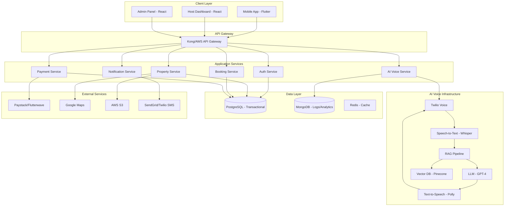
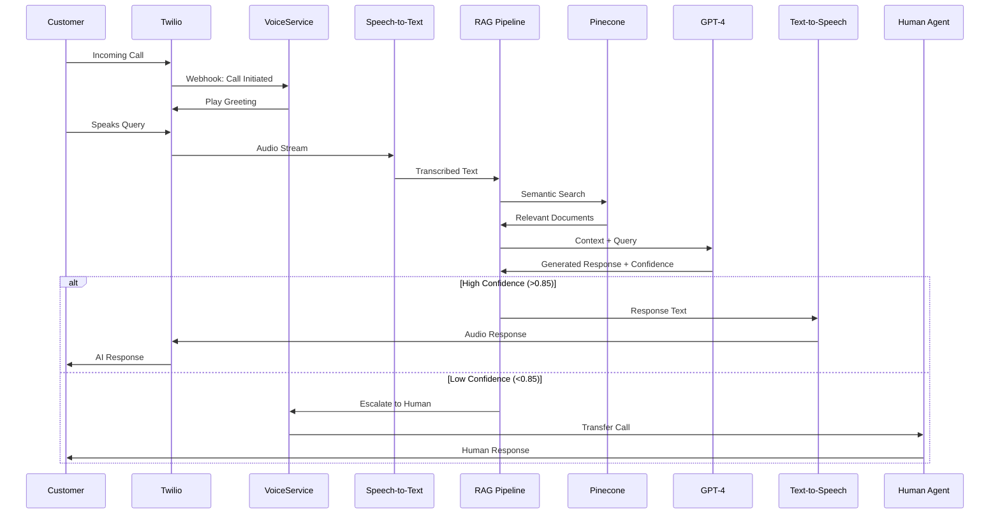
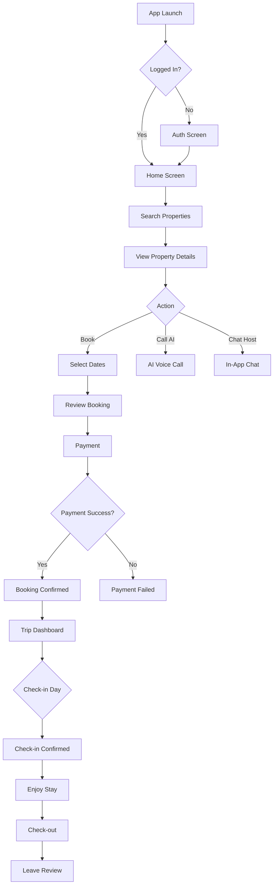
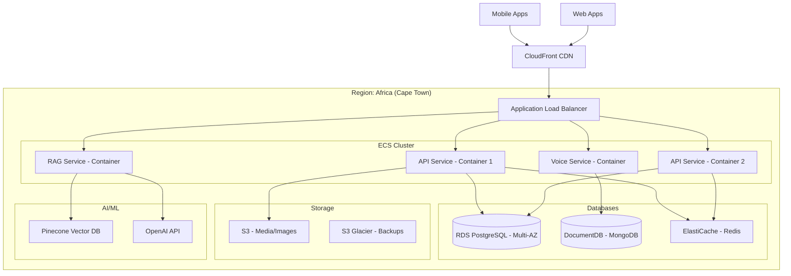

# JustBack Platform - Complete Architecture & Implementation Plan

AI-powered multi-purpose accommodation marketplace for Nigeria with integrated voice call center using RAG (Retrieval-Augmented Generation) technology.

---

## User Review Required

> [!IMPORTANT]
> **Technology Stack Decisions**
> 
> The following key technology choices need confirmation:
> 
> 1. **Mobile Framework**: Flutter vs React Native
>    - **Recommendation**: Flutter (better performance, single codebase, excellent UI)
> 
> 2. **Backend Framework**: Node.js vs Django
>    - **Recommendation**: Node.js with Express/NestJS (better for real-time, microservices)
> 
> 3. **Voice Provider**: Twilio vs Amazon Connect vs Vonage
>    - **Recommendation**: Twilio (most comprehensive, best documentation, Nigerian phone support)
> 
> 4. **Vector Database**: Pinecone vs Weaviate vs FAISS
>    - **Recommendation**: Pinecone (managed service, scales well, good RAG support)
> 
> 5. **LLM Provider**: OpenAI vs Anthropic vs Local Models
>    - **Recommendation**: OpenAI GPT-4 (best Nigerian English understanding, reliable)
> 
> 6. **Cloud Provider**: AWS vs GCP
>    - **Recommendation**: AWS (better Nigerian infrastructure, comprehensive services)

> [!WARNING]
> **Regulatory Compliance**
> 
> - Nigeria Data Protection Regulation (NDPR) compliance required for call recordings
> - Payment provider licenses needed (CBN requirements)
> - Voice call recording consent requirements
> - GDPR readiness for international expansion

> [!CAUTION]
> **AI Voice System Risk Mitigation**
> 
> - **Hallucination Prevention**: Must implement strict RAG guardrails
> - **Fallback Strategy**: Human escalation required for low-confidence responses
> - **Cost Management**: AI voice calls can be expensive - implement per-minute budgets
> - **Nigerian English Accent**: Requires fine-tuning and testing

---

## Proposed Changes

### System Architecture Overview



---

### Component 1: AI Voice Call System with RAG

The core differentiator of JustBack - an intelligent voice assistant that answers customer calls using real business data.

#### [NEW] AI Voice Pipeline Architecture



#### Knowledge Base Data Sources

1. **Property Listings** (Real-time sync)
   - Property names, addresses, descriptions
   - Amenities, room types, capacity
   - Pricing (daily, weekly, monthly)
   - Availability calendar
   - House rules & policies
   - Check-in/check-out times
   - Directions & landmarks

2. **Host-Provided FAQs** (Manually curated)
   - Custom Q&A per property
   - Special instructions
   - Local recommendations
   - Emergency contacts

3. **Company Policies** (Static documents)
   - Cancellation policy (24hrs, 48hrs, etc.)
   - Refund process & timeline
   - Booking modification rules
   - Payment terms
   - Dispute resolution process
   - Safety guidelines

4. **User Context** (Per-call dynamic)
   - Caller's booking history
   - Active reservations
   - Payment status
   - Previous interactions

5. **Location Data**
   - City guides
   - Transportation options
   - Popular attractions
   - Emergency services

#### RAG Pipeline Implementation

**File**: `backend/services/ai-voice/rag-pipeline.js`

```javascript
// Core RAG components
class RAGPipeline {
  constructor() {
    this.vectorDB = new PineconeClient();
    this.embeddings = new OpenAIEmbeddings();
    this.llm = new OpenAI({ model: 'gpt-4' });
  }

  async processQuery(transcript, callContext) {
    // 1. Extract intent
    const intent = await this.extractIntent(transcript);
    
    // 2. Retrieve relevant documents
    const embedding = await this.embeddings.embed(transcript);
    const relevantDocs = await this.vectorDB.query({
      vector: embedding,
      topK: 5,
      filter: this.buildFilter(intent, callContext)
    });
    
    // 3. Generate response with confidence score
    const response = await this.llm.generateWithConfidence({
      context: relevantDocs,
      query: transcript,
      systemPrompt: this.getSystemPrompt(intent)
    });
    
    // 4. Validate response
    if (response.confidence < 0.85) {
      return { escalate: true, reason: 'Low confidence' };
    }
    
    return {
      text: response.text,
      confidence: response.confidence,
      sources: relevantDocs
    };
  }
  
  buildFilter(intent, callContext) {
    // Filter by property, location, user context
    const filters = {};
    
    if (callContext.propertyId) {
      filters.propertyId = callContext.propertyId;
    }
    
    if (intent.category === 'booking') {
      filters.documentType = ['property', 'availability', 'pricing'];
    } else if (intent.category === 'policy') {
      filters.documentType = ['cancellation', 'refund', 'terms'];
    }
    
    return filters;
  }
}
```

**File**: `backend/services/ai-voice/data-ingestion.js`

```javascript
// Continuous sync from database to vector DB
class DataIngestionService {
  async syncProperties() {
    const properties = await Property.find({ status: 'active' });
    
    for (const property of properties) {
      const chunks = this.chunkPropertyData(property);
      
      for (const chunk of chunks) {
        const embedding = await embeddings.embed(chunk.text);
        await vectorDB.upsert({
          id: chunk.id,
          vector: embedding,
          metadata: {
            propertyId: property.id,
            documentType: chunk.type,
            lastUpdated: new Date()
          }
        });
      }
    }
  }
  
  chunkPropertyData(property) {
    // Break property into searchable chunks
    return [
      {
        id: `prop_${property.id}_desc`,
        type: 'property',
        text: `Property: ${property.name}. Location: ${property.address}. Description: ${property.description}`
      },
      {
        id: `prop_${property.id}_amenities`,
        type: 'property',
        text: `Property: ${property.name}. Amenities: ${property.amenities.join(', ')}`
      },
      {
        id: `prop_${property.id}_pricing`,
        type: 'pricing',
        text: `Property: ${property.name}. Price: ₦${property.pricePerNight} per night. Weekly: ₦${property.weeklyPrice}. Monthly: ₦${property.monthlyPrice}`
      }
      // More chunks...
    ];
  }
}
```

#### Voice Infrastructure Components

**File**: `backend/services/ai-voice/twilio-handler.js`

```javascript
// Twilio webhook handlers
class TwilioVoiceHandler {
  async handleIncomingCall(req, res) {
    const twiml = new VoiceResponse();
    
    // Greeting
    twiml.say({
      voice: 'Polly.Amy-Neural',
      language: 'en-US'
    }, 'Hello! Welcome to JustBack. How can I help you today?');
    
    // Start recording and streaming
    twiml.start().stream({
      url: `wss://${process.env.WEBSOCKET_URL}/voice-stream`,
      track: 'inbound_track'
    });
    
    // Gather speech input
    twiml.gather({
      input: 'speech',
      action: '/voice/process-speech',
      speechTimeout: 'auto',
      language: 'en-NG' // Nigerian English
    });
    
    res.type('text/xml');
    res.send(twiml.toString());
  }
  
  async processSpeech(req, res) {
    const transcript = req.body.SpeechResult;
    const callSid = req.body.CallSid;
    
    // Get call context
    const callContext = await this.getCallContext(callSid);
    
    // Process with RAG
    const ragResponse = await ragPipeline.processQuery(transcript, callContext);
    
    const twiml = new VoiceResponse();
    
    if (ragResponse.escalate) {
      // Transfer to human agent
      twiml.say('Let me connect you with one of our team members.');
      twiml.dial(process.env.SUPPORT_PHONE);
    } else {
      // AI response
      twiml.say({
        voice: 'Polly.Amy-Neural'
      }, ragResponse.text);
      
      // Continue conversation
      twiml.gather({
        input: 'speech',
        action: '/voice/process-speech'
      });
    }
    
    // Log interaction
    await this.logConversation(callSid, transcript, ragResponse);
    
    res.type('text/xml');
    res.send(twiml.toString());
  }
}
```

---

### Component 2: Backend API Services

Microservices architecture with dedicated services for each domain.

#### [NEW] Authentication Service

**Tech Stack**: Node.js, JWT, bcrypt, Redis

**Endpoints**:

- `POST /api/v1/auth/register` - User registration
- `POST /api/v1/auth/login` - Login
- `POST /api/v1/auth/refresh` - Refresh token
- `POST /api/v1/auth/logout` - Logout
- `POST /api/v1/auth/verify-email` - Email verification
- `POST /api/v1/auth/forgot-password` - Password reset
- `GET /api/v1/auth/me` - Get current user

#### [NEW] Property Service

**Endpoints**:

- `GET /api/v1/properties` - Search properties (filters: location, price, amenities, dates)
- `GET /api/v1/properties/:id` - Get property details
- `POST /api/v1/properties` - Create listing (host only)
- `PUT /api/v1/properties/:id` - Update listing
- `DELETE /api/v1/properties/:id` - Delete listing
- `GET /api/v1/properties/:id/availability` - Check availability
- `PUT /api/v1/properties/:id/availability` - Update availability calendar
- `GET /api/v1/properties/:id/reviews` - Get reviews
- `POST /api/v1/properties/:id/reviews` - Add review

#### [NEW] Booking Service

**Endpoints**:

- `POST /api/v1/bookings` - Create booking
- `GET /api/v1/bookings/:id` - Get booking details
- `GET /api/v1/bookings` - List bookings (guest/host view)
- `PUT /api/v1/bookings/:id/cancel` - Cancel booking
- `PUT /api/v1/bookings/:id/modify` - Modify booking
- `POST /api/v1/bookings/:id/check-in` - Check-in
- `POST /api/v1/bookings/:id/check-out` - Check-out
- `GET /api/v1/bookings/:id/invoice` - Get invoice

#### [NEW] Payment Service

**Endpoints**:

- `POST /api/v1/payments/initialize` - Initialize payment (Paystack/Flutterwave)
- `POST /api/v1/payments/verify` - Verify payment
- `GET /api/v1/payments/:id` - Get payment details
- `POST /api/v1/payments/refund` - Process refund
- `GET /api/v1/wallet/balance` - Get wallet balance
- `POST /api/v1/wallet/fund` - Fund wallet
- `POST /api/v1/wallet/withdraw` - Withdraw funds
- `GET /api/v1/wallet/transactions` - Transaction history
- `POST /api/v1/payouts` - Host payout (after check-in)

**Escrow Logic**:

```javascript
// Payment held until check-in
async function handleBookingPayment(bookingId, paymentData) {
  // 1. Create escrow record
  const escrow = await Escrow.create({
    bookingId,
    amount: paymentData.amount,
    guestFee: paymentData.amount * 0.05, // 5% service fee
    hostAmount: paymentData.amount * 0.85, // 85% to host (15% commission)
    status: 'HELD',
    releaseDate: booking.checkInDate
  });
  
  // 2. Process payment via Paystack
  const payment = await paystackService.charge({
    amount: paymentData.amount * 100, // In kobo
    email: guest.email,
    reference: `JB-${bookingId}-${Date.now()}`
  });
  
  // 3. On check-in, release funds to host
  // (Automated via cron job checking check-ins)
}

// Automated release after check-in
cron.schedule('*/30 * * * *', async () => {
  const bookings = await Booking.find({
    status: 'CHECKED_IN',
    paymentStatus: 'ESCROWED',
    checkInDate: { $lte: new Date() }
  });
  
  for (const booking of bookings) {
    await releaseEscrowToHost(booking.id);
  }
});
```

#### [NEW] AI Voice Service

**Endpoints**:

- `POST /api/v1/ai-voice/webhook/incoming-call` - Twilio webhook
- `POST /api/v1/ai-voice/webhook/speech` - Speech processing
- `WS /api/v1/ai-voice/stream` - WebSocket for audio streaming
- `GET /api/v1/ai-voice/calls` - List call logs (admin)
- `GET /api/v1/ai-voice/calls/:id` - Get call details & transcript
- `GET /api/v1/ai-voice/calls/:id/recording` - Get call recording
- `POST /api/v1/ai-voice/knowledge-base` - Update knowledge base (admin)
- `GET /api/v1/ai-voice/analytics` - AI call analytics

#### [NEW] Notification Service

**Endpoints**:

- `POST /api/v1/notifications/send` - Send notification (internal)
- `GET /api/v1/notifications` - Get user notifications
- `PUT /api/v1/notifications/:id/read` - Mark as read
- `POST /api/v1/notifications/preferences` - Update notification preferences

**Channels**: Email (SendGrid), SMS (Twilio), Push (FCM), In-app

---

### Component 3: Database Schema

#### PostgreSQL Schema (Transactional Data)

**File**: `backend/database/schema.sql`

```sql
-- Users Table
CREATE TABLE users (
  id UUID PRIMARY KEY DEFAULT gen_random_uuid(),
  email VARCHAR(255) UNIQUE NOT NULL,
  phone VARCHAR(20) UNIQUE,
  password_hash VARCHAR(255) NOT NULL,
  first_name VARCHAR(100) NOT NULL,
  last_name VARCHAR(100) NOT NULL,
  role VARCHAR(20) NOT NULL CHECK (role IN ('guest', 'host', 'admin')),
  avatar_url TEXT,
  email_verified BOOLEAN DEFAULT FALSE,
  phone_verified BOOLEAN DEFAULT FALSE,
  kyc_status VARCHAR(20) DEFAULT 'PENDING', -- For hosts
  wallet_balance DECIMAL(12,2) DEFAULT 0,
  created_at TIMESTAMP DEFAULT NOW(),
  updated_at TIMESTAMP DEFAULT NOW()
);

-- Properties Table
CREATE TABLE properties (
  id UUID PRIMARY KEY DEFAULT gen_random_uuid(),
  host_id UUID REFERENCES users(id) ON DELETE CASCADE,
  title VARCHAR(255) NOT NULL,
  description TEXT NOT NULL,
  property_type VARCHAR(50) NOT NULL CHECK (property_type IN ('hotel', 'apartment', 'house', 'shortlet', 'serviced_apartment')),
  
  -- Location
  address TEXT NOT NULL,
  city VARCHAR(100) NOT NULL,
  state VARCHAR(100) NOT NULL,
  country VARCHAR(100) DEFAULT 'Nigeria',
  latitude DECIMAL(10, 8),
  longitude DECIMAL(11, 8),
  
  -- Capacity
  bedrooms INT NOT NULL,
  bathrooms INT NOT NULL,
  max_guests INT NOT NULL,
  
  -- Pricing
  price_per_night DECIMAL(10,2) NOT NULL,
  weekly_price DECIMAL(10,2),
  monthly_price DECIMAL(10,2),
  cleaning_fee DECIMAL(10,2) DEFAULT 0,
  
  -- Amenities (JSONB array)
  amenities JSONB DEFAULT '[]',
  
  -- Images (JSONB array of URLs)
  images JSONB DEFAULT '[]',
  
  -- Rules & Policies
  house_rules TEXT,
  check_in_time TIME DEFAULT '14:00',
  check_out_time TIME DEFAULT '11:00',
  cancellation_policy VARCHAR(50) DEFAULT '24_hours',
  
  -- Status
  status VARCHAR(20) DEFAULT 'DRAFT' CHECK (status IN ('DRAFT', 'ACTIVE', 'INACTIVE', 'SUSPENDED')),
  
  -- AI Voice - Custom FAQs for this property
  custom_faqs JSONB DEFAULT '[]',
  
  -- Ratings
  average_rating DECIMAL(2,1) DEFAULT 0,
  review_count INT DEFAULT 0,
  
  created_at TIMESTAMP DEFAULT NOW(),
  updated_at TIMESTAMP DEFAULT NOW()
);

-- Property Availability Calendar
CREATE TABLE availability (
  id UUID PRIMARY KEY DEFAULT gen_random_uuid(),
  property_id UUID REFERENCES properties(id) ON DELETE CASCADE,
  date DATE NOT NULL,
  status VARCHAR(20) DEFAULT 'AVAILABLE' CHECK (status IN ('AVAILABLE', 'BOOKED', 'BLOCKED')),
  price_override DECIMAL(10,2), -- Override default price for holidays
  UNIQUE(property_id, date)
);

-- Bookings Table
CREATE TABLE bookings (
  id UUID PRIMARY KEY DEFAULT gen_random_uuid(),
  booking_reference VARCHAR(20) UNIQUE NOT NULL,
  
  -- Parties
  guest_id UUID REFERENCES users(id),
  host_id UUID REFERENCES users(id),
  property_id UUID REFERENCES properties(id),
  
  -- Dates
  check_in_date DATE NOT NULL,
  check_out_date DATE NOT NULL,
  nights INT NOT NULL,
  
  -- Guests
  num_guests INT NOT NULL,
  
  -- Pricing
  subtotal DECIMAL(10,2) NOT NULL,
  cleaning_fee DECIMAL(10,2) DEFAULT 0,
  service_fee DECIMAL(10,2) NOT NULL, -- Guest service fee
  total_amount DECIMAL(10,2) NOT NULL,
  
  -- Status
  status VARCHAR(20) DEFAULT 'PENDING' CHECK (status IN ('PENDING', 'CONFIRMED', 'CHECKED_IN', 'CHECKED_OUT', 'CANCELLED', 'REFUNDED')),
  payment_status VARCHAR(20) DEFAULT 'PENDING' CHECK (payment_status IN ('PENDING', 'PAID', 'ESCROWED', 'RELEASED', 'REFUNDED')),
  
  -- Check-in/out
  checked_in_at TIMESTAMP,
  checked_out_at TIMESTAMP,
  
  -- Notes
  guest_notes TEXT,
  cancellation_reason TEXT,
  cancelled_at TIMESTAMP,
  
  created_at TIMESTAMP DEFAULT NOW(),
  updated_at TIMESTAMP DEFAULT NOW()
);

-- Payments Table
CREATE TABLE payments (
  id UUID PRIMARY KEY DEFAULT gen_random_uuid(),
  booking_id UUID REFERENCES bookings(id),
  user_id UUID REFERENCES users(id),
  
  payment_type VARCHAR(20) CHECK (payment_type IN ('BOOKING', 'WALLET_FUNDING', 'REFUND')),
  gateway VARCHAR(20) CHECK (gateway IN ('PAYSTACK', 'FLUTTERWAVE', 'STRIPE', 'WALLET')),
  
  amount DECIMAL(10,2) NOT NULL,
  currency VARCHAR(3) DEFAULT 'NGN',
  
  -- Gateway response
  reference VARCHAR(255) UNIQUE NOT NULL,
  gateway_reference VARCHAR(255),
  gateway_response JSONB,
  
  status VARCHAR(20) DEFAULT 'PENDING' CHECK (status IN ('PENDING', 'SUCCESS', 'FAILED')),
  
  created_at TIMESTAMP DEFAULT NOW()
);

-- Escrow Table (for holding booking payments)
CREATE TABLE escrow (
  id UUID PRIMARY KEY DEFAULT gen_random_uuid(),
  booking_id UUID REFERENCES bookings(id),
  payment_id UUID REFERENCES payments(id),
  
  total_amount DECIMAL(10,2) NOT NULL,
  guest_fee DECIMAL(10,2) NOT NULL, -- Platform fee from guest
  host_commission DECIMAL(10,2) NOT NULL, -- Platform commission from host
  host_payout DECIMAL(10,2) NOT NULL, -- Amount to release to host
  
  status VARCHAR(20) DEFAULT 'HELD' CHECK (status IN ('HELD', 'RELEASED', 'REFUNDED')),
  
  -- Release date (check-in date)
  scheduled_release_date DATE NOT NULL,
  released_at TIMESTAMP,
  
  created_at TIMESTAMP DEFAULT NOW()
);

-- Reviews Table
CREATE TABLE reviews (
  id UUID PRIMARY KEY DEFAULT gen_random_uuid(),
  booking_id UUID REFERENCES bookings(id),
  property_id UUID REFERENCES properties(id),
  reviewer_id UUID REFERENCES users(id),
  reviewee_id UUID REFERENCES users(id), -- Host being reviewed
  
  rating INT NOT NULL CHECK (rating >= 1 AND rating <= 5),
  comment TEXT,
  
  -- Detailed ratings
  cleanliness_rating INT CHECK (cleanliness_rating >= 1 AND cleanliness_rating <= 5),
  accuracy_rating INT CHECK (accuracy_rating >= 1 AND accuracy_rating <= 5),
  communication_rating INT CHECK (communication_rating >= 1 AND communication_rating <= 5),
  location_rating INT CHECK (location_rating >= 1 AND location_rating <= 5),
  value_rating INT CHECK (value_rating >= 1 AND value_rating <= 5),
  
  created_at TIMESTAMP DEFAULT NOW()
);

-- Wallet Transactions
CREATE TABLE wallet_transactions (
  id UUID PRIMARY KEY DEFAULT gen_random_uuid(),
  user_id UUID REFERENCES users(id),
  
  type VARCHAR(20) CHECK (type IN ('CREDIT', 'DEBIT')),
  amount DECIMAL(10,2) NOT NULL,
  balance_after DECIMAL(10,2) NOT NULL,
  
  description TEXT NOT NULL,
  reference VARCHAR(255),
  
  -- Related entities
  booking_id UUID REFERENCES bookings(id),
  payment_id UUID REFERENCES payments(id),
  
  created_at TIMESTAMP DEFAULT NOW()
);

-- Messages/Chat
CREATE TABLE messages (
  id UUID PRIMARY KEY DEFAULT gen_random_uuid(),
  booking_id UUID REFERENCES bookings(id),
  sender_id UUID REFERENCES users(id),
  receiver_id UUID REFERENCES users(id),
  
  message TEXT NOT NULL,
  read BOOLEAN DEFAULT FALSE,
  
  created_at TIMESTAMP DEFAULT NOW()
);

-- Indexes for performance
CREATE INDEX idx_properties_city ON properties(city);
CREATE INDEX idx_properties_status ON properties(status);
CREATE INDEX idx_properties_host ON properties(host_id);
CREATE INDEX idx_bookings_guest ON bookings(guest_id);
CREATE INDEX idx_bookings_host ON bookings(host_id);
CREATE INDEX idx_bookings_property ON bookings(property_id);
CREATE INDEX idx_bookings_dates ON bookings(check_in_date, check_out_date);
CREATE INDEX idx_availability_property_date ON availability(property_id, date);
```

#### MongoDB Collections (Logs & Analytics)

**File**: `backend/database/mongodb-schema.js`

```javascript
// AI Voice Call Logs
const CallLogSchema = new Schema({
  callSid: { type: String, required: true, unique: true },
  userId: { type: String, ref: 'User' }, // If authenticated
  phoneNumber: String,
  
  // Call details
  direction: { type: String, enum: ['inbound', 'outbound'] },
  duration: Number, // seconds
  recordingUrl: String,
  
  // Conversation
  transcript: [{
    speaker: { type: String, enum: ['customer', 'ai', 'agent'] },
    text: String,
    timestamp: Date,
    confidence: Number
  }],
  
  // RAG details
  retrievedDocuments: [{
    documentId: String,
    documentType: String,
    relevanceScore: Number,
    content: String
  }],
  
  // Outcome
  resolvedByAI: Boolean,
  escalatedToHuman: Boolean,
  escalationReason: String,
  humanAgentId: String,
  
  // Intent classification
  intents: [String], // ['booking_inquiry', 'price_check', 'directions']
  
  // Metadata
  propertyId: String,
  bookingId: String,
  
  // Quality metrics
  averageConfidence: Number,
  customerSatisfaction: Number,
  
  createdAt: { type: Date, default: Date.now }
});

// Knowledge Base Documents
const KnowledgeDocumentSchema = new Schema({
  documentId: { type: String, required: true, unique: true },
  documentType: { 
    type: String, 
    enum: ['property', 'policy', 'faq', 'location', 'guide'],
    required: true 
  },
  
  // Source
  sourceId: String, // propertyId, policyId, etc.
  sourceType: String,
  
  // Content
  title: String,
  content: String,
  chunks: [{
    chunkId: String,
    text: String,
    vectorId: String, // Pinecone vector ID
    metadata: Object
  }],
  
  // Versioning
  version: { type: Number, default: 1 },
  lastSynced: Date,
  
  // Status
  active: { type: Boolean, default: true },
  
  createdAt: { type: Date, default: Date.now },
  updatedAt: { type: Date, default: Date.now }
});

// Analytics Events
const AnalyticsEventSchema = new Schema({
  eventType: String, // 'search', 'view_property', 'booking_attempt', etc.
  userId: String,
  sessionId: String,
  
  properties: Object, // Event-specific data
  
  // Device info
  platform: String, // 'mobile', 'web'
  device: String,
  os: String,
  
  timestamp: { type: Date, default: Date.now }
});
```

---

### Component 4: Mobile Application Architecture

**Framework**: Flutter (Recommended)

#### App Structure

```
mobile/
├── lib/
│   ├── main.dart
│   ├── app.dart
│   ├── core/
│   │   ├── constants/
│   │   ├── themes/
│   │   ├── utils/
│   │   └── network/
│   │       ├── api_client.dart
│   │       ├── dio_interceptor.dart
│   │       └── endpoints.dart
│   ├── features/
│   │   ├── auth/
│   │   │   ├── presentation/
│   │   │   ├── domain/
│   │   │   └── data/
│   │   ├── home/
│   │   ├── search/
│   │   ├── property/
│   │   ├── booking/
│   │   ├── chat/
│   │   ├── voice_call/  # AI voice integration
│   │   ├── wallet/
│   │   └── profile/
│   └── shared/
│       ├── widgets/
│       └── models/
```

#### Key Features Implementation

**File**: `mobile/lib/features/voice_call/ai_voice_service.dart`

```dart
// AI Voice Call Integration
class AIVoiceService {
  final Dio _dio;
  
  // Initiate AI voice call
  Future<void> initiateAICall({
    String? propertyId,
    String? bookingId,
    String callReason = 'inquiry'
  }) async {
    // Request callback from AI system
    final response = await _dio.post('/api/v1/ai-voice/request-call', data: {
      'userId': await AuthService.getUserId(),
      'propertyId': propertyId,
      'bookingId': bookingId,
      'callReason': callReason
    });
    
    // AI will call user's phone number
    // Show waiting dialog
    Get.dialog(
      CallRequestDialog(
        message: 'Our AI assistant will call you shortly...',
        estimatedWaitTime: response.data['estimatedWaitTime']
      )
    );
  }
  
  // In-app voice call (WebRTC)
  Future<void> initiateInAppVoiceCall(String propertyId) async {
    // Get Twilio access token
    final token = await _dio.get('/api/v1/ai-voice/token');
    
    // Initialize Twilio Voice SDK
    final call = await TwilioVoice.connect(
      accessToken: token.data['accessToken'],
      params: {
        'To': 'AI_ASSISTANT',
        'propertyId': propertyId
      }
    );
    
    // Navigate to call screen
    Get.to(() => AICallScreen(call: call));
  }
}
```

#### User Flow Diagrams



---

### Component 5: Admin Dashboard

**Framework**: React with TypeScript

#### Key Admin Features

1. **System Monitoring**
   - Real-time booking metrics
   - Revenue dashboard
   - Active users tracking
   - Server health monitoring

2. **AI Voice Call Center Management**
   - Live call monitoring
   - Call history with transcripts
   - Agent performance metrics
   - Escalation queue
   - Knowledge base management

3. **User & Property Management**
   - Approve/reject listings
   - KYC verification for hosts
   - User support & disputes
   - Fraud detection alerts

4. **Analytics & Reports**
   - Revenue by city/property type
   - AI vs Human resolution rates
   - Customer satisfaction scores
   - Conversion funnels

**File**: `admin-dashboard/src/pages/AICallCenter/CallLogs.tsx`

```typescript
// AI Call Center - Real-time Call Monitoring
interface CallLog {
  callSid: string;
  customerPhone: string;
  duration: number;
  status: 'active' | 'completed' | 'escalated';
  transcript: TranscriptMessage[];
  aiConfidence: number;
  resolvedByAI: boolean;
}

const CallLogsPage: React.FC = () => {
  const [calls, setCalls] = useState<CallLog[]>([]);
  const [selectedCall, setSelectedCall] = useState<CallLog | null>(null);
  
  // Real-time updates via WebSocket
  useEffect(() => {
    const ws = new WebSocket('wss://api.justback.ng/admin/call-stream');
    
    ws.onmessage = (event) => {
      const update = JSON.parse(event.data);
      setCalls(prev => updateCallList(prev, update));
    };
    
    return () => ws.close();
  }, []);
  
  return (
    <div className="call-logs-container">
      <div className="calls-list">
        {calls.map(call => (
          <CallCard 
            key={call.callSid} 
            call={call}
            onClick={() => setSelectedCall(call)}
          />
        ))}
      </div>
      
      {selectedCall && (
        <CallDetails call={selectedCall}>
          <TranscriptView transcript={selectedCall.transcript} />
          <RetrievedDocuments documents={selectedCall.retrievedDocs} />
          <AIMetrics confidence={selectedCall.aiConfidence} />
          
          {selectedCall.status === 'active' && (
            <button onClick={() => escalateToHuman(selectedCall.callSid)}>
              Transfer to Human Agent
            </button>
          )}
        </CallDetails>
      )}
    </div>
  );
};
```

---

### Component 6: Host/Vendor Dashboard

**Framework**: React with TypeScript

#### Key Host Features

1. **Property Management**
   - Create/edit listings
   - Upload photos
   - Set pricing & availability
   - Manage custom FAQs for AI

2. **Booking Management**
   - View incoming bookings
   - Accept/decline requests
   - Check-in/check-out guests
   - Manage calendar

3. **AI Voice Assistant**
   - View AI call logs for properties
   - Update property-specific FAQs
   - Review AI responses & accuracy
   - Subscribe to AI call handling

4. **Earnings & Payouts**
   - Revenue dashboard
   - Payout scheduling
   - Transaction history
   - Tax documents

**File**: `host-dashboard/src/pages/AIAssistant/KnowledgeBase.tsx`

```typescript
// Host manages custom FAQs for their property
const PropertyKnowledgeBase: React.FC<{ propertyId: string }> = ({ propertyId }) => {
  const [faqs, setFaqs] = useState<FAQ[]>([]);
  
  const addFAQ = async (question: string, answer: string) => {
    await api.post(`/api/v1/properties/${propertyId}/faqs`, {
      question,
      answer,
      category: 'custom'
    });
    
    // This will be ingested into vector DB for RAG
    await api.post('/api/v1/ai-voice/knowledge-base/sync', {
      propertyId
    });
    
    toast.success('FAQ added and AI knowledge base updated!');
  };
  
  return (
    <div className="knowledge-base">
      <h2>Property AI Assistant - Custom FAQs</h2>
      <p>Add frequently asked questions to help our AI assistant answer guest inquiries</p>
      
      <FAQList faqs={faqs} onDelete={deleteFAQ} onEdit={editFAQ} />
      <AddFAQForm onSubmit={addFAQ} />
      
      <CallHistory propertyId={propertyId} />
    </div>
  );
};
```

---

## Verification Plan

### Automated Tests

```bash
# Backend API Tests
cd backend
npm run test:unit          # Unit tests for services
npm run test:integration   # API endpoint tests
npm run test:e2e           # End-to-end booking flow

# RAG Pipeline Tests
npm run test:rag           # RAG accuracy tests
npm run test:voice         # Voice infrastructure tests

# Mobile App Tests
cd mobile
flutter test               # Widget & unit tests
flutter integration_test   # Integration tests

# Load Testing
k6 run load-tests/booking-flow.js
k6 run load-tests/ai-voice-concurrent-calls.js
```

### Manual Verification

1. **AI Voice System Testing**
   - [ ] Make 50 test calls with various queries
   - [ ] Verify RAG retrieves correct property info
   - [ ] Test escalation to human agents
   - [ ] Verify Nigerian English comprehension
   - [ ] Test with background noise

2. **Payment Flow**
   - [ ] Test Paystack integration (NGN)
   - [ ] Test Flutterwave integration
   - [ ] Verify escrow holds until check-in
   - [ ] Test refund scenarios
   - [ ] Verify wallet transactions

3. **Mobile App Testing**
   - [ ] Test on Android (multiple devices)
   - [ ] Test on iOS (iPhone)
   - [ ] Verify responsive design
   - [ ] Test offline mode
   - [ ] Test push notifications

4. **Admin Dashboard**
   - [ ] Test real-time call monitoring
   - [ ] Verify transcript accuracy
   - [ ] Test knowledge base management
   - [ ] Verify analytics dashboards

5. **Security Testing**
   - [ ] Penetration testing
   - [ ] API authentication tests
   - [ ] NDPR compliance audit
   - [ ] Voice data encryption verification

---

## Deployment Strategy

### Infrastructure Architecture (AWS)



### Deployment Steps

#### Phase 1: Infrastructure Setup

```bash
# 1. Provision AWS infrastructure (Terraform)
cd infrastructure/terraform
terraform init
terraform plan -out=plan.tfplan
terraform apply plan.tfplan

# 2. Set up databases
aws rds create-db-instance --db-instance-identifier justback-prod-postgres
aws docdb create-db-cluster --db-cluster-identifier justback-prod-mongo

# 3. Configure Pinecone vector database
pinecone create-index justback-knowledge-base --dimension 1536 --metric cosine

# 4. Set up Twilio
twilio phone-numbers:buy --country-code NG --phone-number +234XXXXXXXXX
twilio phone-numbers:update +234XXXXXXXXX --voice-url https://api.justback.ng/voice/webhook
```

#### Phase 2: Backend Deployment

```bash
# Build Docker images
docker build -t justback/api:v1.0 ./backend/services/api
docker build -t justback/voice:v1.0 ./backend/services/voice
docker build -t justback/rag:v1.0 ./backend/services/rag

# Push to ECR
aws ecr get-login-password | docker login --username AWS --password-stdin
docker push justback/api:v1.0
docker push justback/voice:v1.0
docker push justback/rag:v1.0

# Deploy to ECS
aws ecs create-service --cluster justback-prod --service-name api-service --task-definition api:1
aws ecs create-service --cluster justback-prod --service-name voice-service --task-definition voice:1
```

#### Phase 3: Mobile App Deployment

```bash
# Android
cd mobile
flutter build apk --release
# Upload to Google Play Console

# iOS
flutter build ipa --release
# Upload to App Store Connect via Xcode
```

#### Phase 4: Knowledge Base Initial Sync

```bash
# Sync all properties to vector database
node scripts/sync-knowledge-base.js --full-sync

# Verify embeddings
node scripts/verify-rag-pipeline.js
```

### CI/CD Pipeline

**File**: `.github/workflows/deploy-production.yml`

```yaml
name: Deploy to Production

on:
  push:
    branches: [main]

jobs:
  test:
    runs-on: ubuntu-latest
    steps:
      - uses: actions/checkout@v3
      - name: Run API tests
        run: |
          cd backend
          npm install
          npm run test
      
      - name: Run RAG tests
        run: |
          cd backend
          npm run test:rag
  
  build-and-deploy:
    needs: test
    runs-on: ubuntu-latest
    steps:
      - name: Build Docker images
        run: docker build -t justback/api:${{ github.sha }} .
      
      - name: Push to ECR
        run: |
          aws ecr get-login-password | docker login
          docker push justback/api:${{ github.sha }}
      
      - name: Deploy to ECS
        run: |
          aws ecs update-service --cluster justback-prod \
            --service api-service \
            --force-new-deployment
  
  deploy-mobile:
    needs: test
    runs-on: macos-latest
    steps:
      - name: Build Flutter app
        run: |
          cd mobile
          flutter build apk --release
          flutter build ios --release
      
      - name: Deploy to Play Store (beta)
        uses: r0adkll/upload-google-play@v1
        with:
          serviceAccountJsonPlainText: ${{ secrets.PLAY_STORE_KEY }}
          packageName: ng.justback.app
          releaseFiles: build/app/outputs/flutter-apk/app-release.apk
          track: beta
```

### Monitoring & Logging

```javascript
// CloudWatch Alarms
- API Error Rate > 5%
- AI Call Escalation Rate > 30%
- RAG Confidence Score < 0.80 (average)
- Database CPU > 80%
- Response Time > 2s (p95)

// Logging Stack
- Application Logs: CloudWatch Logs
- AI Call Transcripts: S3 + Athena for querying
- Metrics: Prometheus + Grafana
- Error Tracking: Sentry
- APM: New Relic / DataDog
```

### Scalability Milestones

**Phase 1: Lagos Launch (Month 1-3)**
- Target: 1,000 properties, 10,000 users
- Infrastructure: 2 API instances, 1 Voice instance
- AI Calls: ~500/day

**Phase 2: Nigeria Expansion (Month 4-12)**
- Target: 10,000 properties, 100,000 users
- Infrastructure: Auto-scaling (2-10 instances)
- AI Calls: ~5,000/day

**Phase 3: Africa Expansion (Year 2)**
- Target: 50,000 properties, 1M users
- Infrastructure: Multi-region deployment
- AI Calls: ~20,000/day

---

## Cost Estimation (Monthly)

### Infrastructure Costs

| Service | Tier | Cost (USD) |
|---------|------|------------|
| **AWS EC2/ECS** | 4x t3.large | $280 |
| **RDS PostgreSQL** | db.t3.large Multi-AZ | $350 |
| **DocumentDB** | 3-node cluster | $400 |
| **ElastiCache Redis** | cache.t3.medium | $80 |
| **S3 Storage** | 1TB + transfers | $50 |
| **CloudFront CDN** | 1TB data transfer | $85 |
| **Load Balancer** | ALB | $25 |

### AI & Voice Costs

| Service | Usage | Cost (USD) |
|---------|-------|------------|
| **Twilio Voice** | 5,000 calls x 3min avg | $750 |
| **OpenAI GPT-4** | 500K tokens/day | $600 |
| **Whisper (Speech-to-Text)** | 250 hours | $150 |
| **Polly (Text-to-Speech)** | 1M characters | $16 |
| **Pinecone Vector DB** | 100K vectors | $70 |

### Payment Gateway Fees

- Paystack: 1.5% + ₦100 per transaction (on ₦10M GMV = ~₦250K = $170)
- Flutterwave: Similar

### Total Monthly Cost (Phase 1)

- Infrastructure: ~$1,320
- AI & Voice: ~$1,586
- **Total: ~$3,000/month** (for 5,000 AI calls, 10K users)

Revenue needed to break even: ₦5M GMV (10% commission = ₦500K = ~$340) + AI subscriptions

---

## Next Steps

1. **Technology Stack Confirmation** - Please review the recommended tech stack in the "User Review Required" section
2. **Project Setup** - Create repositories and initialize projects
3. **Database Implementation** - Set up PostgreSQL and MongoDB schemas
4. **RAG Pipeline Development** - Build the AI voice infrastructure
5. **API Development** - Implement backend services
6. **Mobile App Development** - Build Flutter applications
7. **Testing & Deployment** - Launch MVP in Lagos

---

## Additional Documentation Needed

Once approved, I will create:

1. **API Documentation** - Detailed Swagger/OpenAPI specs for all endpoints
2. **RAG Pipeline Technical Spec** - Embedding models, retrieval logic, prompt engineering
3. **Mobile App Wireframes** - Complete UI/UX designs for guest and host flows
4. **Security & Compliance Guide** - NDPR implementation, data protection policies
5. **Host Onboarding Guide** - How to list properties and manage AI assistant
